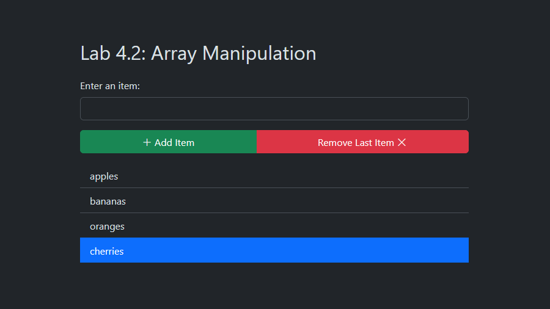

# Lab 4.2: Array Manipulation

[Karl Johnson](https://github.com/hirekarl)  
2025-RTT-30  
<date datetime="2025-06-19">2025-06-19</date>  



## Overview
### Viewer Instructions
To view solutions to Task 1 and Task 2 in the terminal, run\*:

```bash
node index
```

To view solution to Task 3 in the browser, open [`./index.html`](./index.html) with Live Server or navigate to [[url goes here]]().

*\*Note that custom text colors (implemented with ANSI escape sequences) may not work in Visual Studio Code's default Output pane with Run Code&mdash;run from the Terminal pane with `node index`.*


### Solution Source
- **Task 1**, **Task 2**: [`./index.js`](./index.js).
- **Task 3**: [`./index.js`](./index.js), [`./index.html`](./index.html)

### Scenario
You have been assigned to work on a feature that handles large sets of data in the form of arrays. You need to build efficient functionality to add, remove, and filter data from arrays based on user interactions. In this assignment, you will practice manipulating arrays with JavaScript methods and writing code that dynamically handles user inputs.

### Lab Instructions
#### Task 1: Array Manipulation Basics
1. Create an empty array called `shoppingList`.
2. Write a function called `addItem` that takes an item as a parameter and adds it to the `shoppingList` array.
3. Write a function called `removeLastItem` that removes the last item from the `shoppingList` array.
4. Write a function called `displayList` that logs all items in the `shoppingList` array to the console.

#### Task 2: Filter and Search an Array
1. Modify the `addItem` function to only add the item if it is not already in the `shoppingList` array.
2. Write a function called `filterItems` that takes a search term as a parameter and returns all items in the `shoppingList` that contain that search term (case-insensitive).

#### Task 3: Render the List in the Browser
1. Create an HTML page with an input field, an “Add Item” button, and an unordered list to display the items.
2. Write a JavaScript function that adds items to the array and updates the displayed list dynamically when the button is clicked.
3. Write another function that removes the last item and updates the displayed list when a “Remove Last Item” button is clicked.

### Reflection
After completing this lab, reflect on the following questions:

1. How did array methods like `push()` and `filter()` help you manipulate data in this activity?


2. What challenges did you face when trying to filter and search for items in the array?


3. How would you modify this code to make it more efficient or user-friendly?

